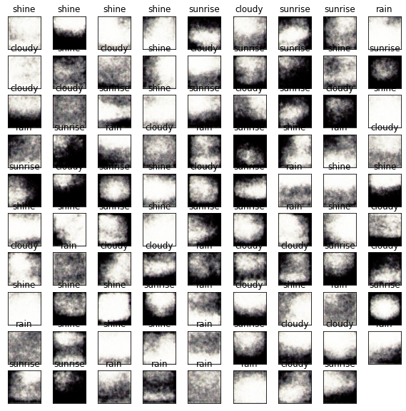
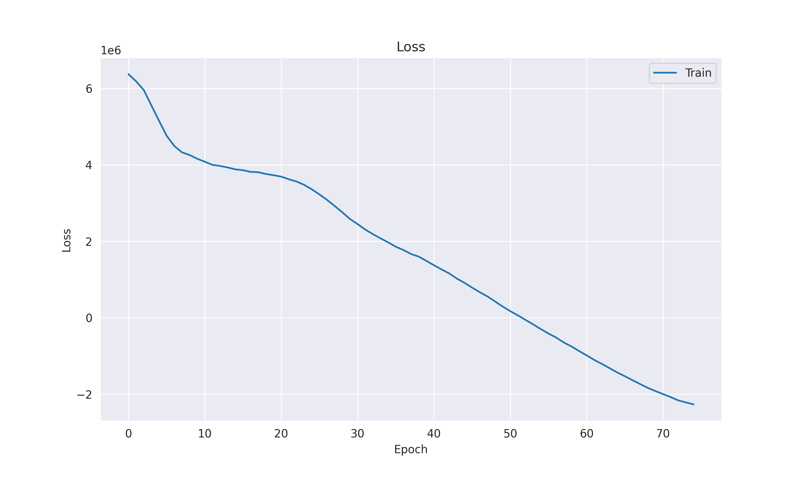

 

 
    <h3 align="right"> 
        
            Sertan Avdan & Özkan Kara
        
    </h3> 

# Variational Autoencoder (VAE)
In this notebook, we implement a Variational Autoencoder (VAE) for generating new images from a given dataset. VAEs are a type of generative model that learn a low-dimensional latent representation of the input data. They consist of an encoder, which maps the input data to a latent space, and a decoder, which reconstructs the input data from the latent space. The key feature of VAEs is the introduction of a variational layer that models the latent space as a probabilistic distribution.

 
    
    

## Process Overview
Import necessary libraries: We import the required libraries, such as PyTorch, NumPy, pandas, seaborn, and matplotlib for implementing the VAE and visualizing the results.

Load and preprocess the dataset: The dataset is loaded using a DataLoader, which provides an easy way to iterate through batches of images. The images are preprocessed by resizing and normalizing them.

Define the VAE architecture: The VAE consists of an encoder and a decoder. The encoder maps the input image to the parameters of a Gaussian distribution in the latent space. The decoder reconstructs the image from a sample drawn from this Gaussian distribution.

Define the loss function: The loss function consists of two parts: the reconstruction loss (Binary Cross-Entropy loss) and the Kullback-Leibler divergence (KLD). The reconstruction loss measures how well the decoder can reconstruct the input images, while the KLD measures the difference between the learned latent distribution and the prior distribution.

## Training loop: We train the VAE using the following steps:

1. Iterate through the dataset for a given number of epochs.
2) Load a batch of images and move them to the appropriate device (CPU or GPU).
3) Perform a forward pass through the encoder to obtain the parameters of the Gaussian distribution in the latent space.
4) Sample a point from the Gaussian distribution and pass it through the decoder to generate a reconstructed image.
5) Compute the loss (reconstruction loss + KLD) and perform backpropagation.
6) Update the model's parameters using an optimizer.
7) Visualize the training loss: We store the training loss for each epoch in a list and plot it using seaborn and matplotlib to analyze the training progress.

Generate new images: After training, we can use the VAE to generate new images by sampling from the latent space and passing the samples through the decoder.
